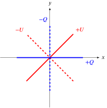
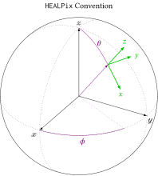

# Coordinate Systems and Conventions

This chapter describes and codifies the coordinate systems and conventions which will be
used throughout the documentation system.

## Spherical coordinates

Specifying the location on a unit sphere requires two values, and there are two common
choices: latitude/longitude (familiar from maps) and colatitude/azimuth (typically used
in math and physics).

### [Latitude and Longitude coordinates](@id latloncoords)

* A position on the sphere is given by a pair of latitude and longitude coordinates
  $(\delta,\lambda)$.
  The latitude $\delta$ measures the angle north or south of the equator
  ($-\frac{\pi}{2} \le \delta \le \frac{\pi}{2}$).
  The longitude $\lambda$ measure the angle east or west of the prime meridian
  ($-\pi \le \lambda \le \pi$).

* ```math
    \hat{\mathbf{r}}
    = \begin{pmatrix} x \\ y \\ z \end{pmatrix}
    = \begin{pmatrix}
        \cos\delta \cos\lambda \\
        \cos\delta \sin\lambda \\
        \sin\delta
    \end{pmatrix}
  ```

### [Colatitude and Azimuth coordinates](@id colatazcoords)

* A position on the sphere is given by a pair of colatitude and azimith coordinates
  $(\theta,\phi)$.
  The colatitude $\theta$ measures the angle south of the North Pole
  ($0 \le \theta \le \pi$).
  The azimuth $\phi$ measure the angle east of the prime meridian
  ($0 \le \lambda \le 2\pi$).

* ```math
    \hat{\mathbf{r}}
    = \begin{pmatrix} x \\ y \\ z \end{pmatrix}
    = \begin{pmatrix}
        \sin\theta \cos\phi \\
        \sin\theta \sin\phi \\
        \cos\theta
    \end{pmatrix}
  ```

## [Stokes Parameters](@id stokesparms)

The Stokes parameters $I$, $Q$, $U$, and $V$ are a standard notation for describing the
polarization state of electromagnetic radiation.
In this section, we only concern ourselves with the $Q$ and $U$ parameters which specify the
linear polarization state.

In review, The Stokes parameters are defined by the oscillation of the electric field in the
$x$- and $y$-axes of a local, right-handed coordinate system where the wave propagates in
the $z$ direction.
Given the time-varying, complex electric field amplitudes $E_x$ and $E_y$, $Q$ and $U$ are
defined as,
```math
    \begin{aligned}
        Q &\equiv \left\langle |E_x|^2 - |E_y|^2 \right\rangle
        \\
        U &\equiv 2\left\langle |E_x||E_y|\cos \varphi \right\rangle
    \end{aligned}
```
where $\varphi$ is the phase difference between the two components.
Graphically, this is summarized by the following figure:
$+Q$ lies along the $x$-axis, $-Q$ lies along the $y$-axis, $+U$ bisects the
axes along $\pi/4$, and $-U$ is perpendicular to $+U$ along $3\pi/4$.



The mathematical definition of $Q$ and $U$ references against a local coordinate system.
When considering the surface of the sphere, there are an infinite number of ways to define a
local coordinate system at each point.
This ambiguity is resolved by also specifying how $x$, $y$, and $z$ are defined at each
point on the sphere.
In CMB, there are two common conventions: the IAU and HEALPix conventions, and both will be
summarized below.

### [IAU Convention](@id iaupolconv)

The International Astronomical Union (IAU) endorsed a unified coordinate system convention
for use in radio astronomy ([Hamaker and Begman, 1996](@ref bib-coordinates)).
We identify a point on a sphere with two angles.
In the IAU definition, these are specified as [Latitude and Longitude coordinates](@ref
latloncoords).
Then at any point on the sphere, the local Stokes coordinate system is arranged such that
the $x$-axis points north, and the $y$-axis points east.
This necessarily defines the $z$-axis to be a radial vector pointing to the center of the
sphere for a right-handed coordinate system.


### [HEALPix Convention](@id healpixpolconv)

In HEALPix, the choice of coordinates on the sphere follow common math and physics
conventions where a point is specified by [Colatitude and Azimuth coordinates](@ref
colatazcoords).
Then, the local Stokes coordinates are set such that $x$-axis points south,
and the $y$-axis points east.
This defines the $z$-axis to be a radial vector pointing away from the center
of the sphere for a right-handed coordinate system.



