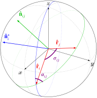

# [Spherical Functions](@id man_sphere)

```@contents
Pages = ["sphere.md"]
Depth = 2
```

A key aspect of computing pixel-pixel covariance is calculating relative
orientations of the two pixels on the sphere. The [`Sphere`](@ref) module
implements a few basic spherical functions. For HEALPix-specific calculations,
see the [`HEALPix` Pixelization](@ref man_healpix) documentation instead.

## [Definitions](@id sphere_defn)

* A colatitude-azimuth pair ``(\theta, \phi)`` are coordinates on the sphere measuring
  the angular distance (in radians) from the North pole and east of the Prime
  Meridian, respectively. The coordinates will typically be normalized to
  the range ``\theta \in [0, \pi]`` and ``\phi \in [0, 2\pi)``.

* A latitude-longitude pair ``(\delta, \lambda)`` are coordinates on the sphere measuring
  the angular distance (in degrees) north or south of the Equator and east
  or west of the Prime Meridian, respectively. The coordinates will typically
  be normalized to the range ``\delta \in [-90, 90]`` and ``\lambda \in [-180, 180]``.

* A Cartesian unit vector ``\vec r`` centered at the origin of a sphere
  has its end-point at a location on the unit sphere.
  The coordinate system is right-handed, with the North Pole located at
  ``\hat z = [0, 0, 1]`` and the intersection of the Prime Meridian and
  Equator located at ``\hat x = [1, 0, 0]``.

In general, the function throughout the `CMB` package will take either
colatitude-azimuth or unit vector coordinates.

## [Usage](@id sphere_usage)

Conversion between colatitude-azimuth pairs, latitude-longitude pairs,
and unit vectors can be accomplished via the unexported functions
[`Sphere.colataz`](@ref), [`Sphere.latlon`](@ref), and
[`Sphere.cartvec`](@ref).

```jldoctest sphereusage
julia> using CMB.Sphere

julia> using CMB.Sphere: colataz, latlon, cartvec

julia> δ, λ = 44.97531, -93.23471;  # Tate Lab @ Univ. of Minnesota

julia> θ, ϕ = colataz(δ, λ)         # lat-lon to colat-az
(0.7858290851897657, 4.655932640537504)

julia> latlon(θ, ϕ)                 # colat-az to lat-lon
(44.97531, -93.23471)

julia> r = cartvec(θ, ϕ)            # colat-az to unit vector
3-element StaticArrays.SVector{3, Float64} with indices SOneTo(3):
 -0.03991664732478908
 -0.7062843499648845
  0.7068020078218715

julia> colataz(r)       # unit vector to colat-az
(0.7858290851897657, 4.655932640537504)

julia> latlon(r)        # unit vector to lat-lon
(44.97531000000001, -93.23471000000002)
```

Given two points on the sphere — represented as either a unit vector or a
colatitude-azimuth pair — we can query for the angular distance between the
two points with the [`distance`](@ref) function:
```jldoctest sphereusage
julia> r₁ = cartvec(colataz(-0.18114, -78.46762)); # Quito, Ecuador

julia> r₂ = cartvec(colataz(69.64906,  18.95454)); # Tromsø, Norway

julia> σ = distance(r₁, r₂)
1.6187031137492613
```
In situations where the cosine of the separation is required instead — such
as for [Legendre polynomial](https://github.com/jmert/Legendre.jl) calculations
— it is more efficient to directly return the cosine of the angle with the
[`cosdistance`](@ref) function:
```jldoctest sphereusage
julia> cosdistance(r₁, r₂)
-0.047888464230114274
```

The angular separation alone is insufficient for describing the relative
orientation of the two points; the orientation angle of the great circle
connecting the two must be given with respect to some reference. A common
choice is the bearing angle[^1]. It measures the angle between the meridian
(at one of the points) and the great circle connecting the two, as shown by
the angle ``\alpha_{ij}`` in Figure 1.

```@raw html
<figure>
```

```@raw html
<figcaption style="font-size:smaller; text-align:left; font-style: normal;">
```
**Figure 1:** Example showing the angular separation ``\sigma_{ij}`` and bearing
angle ``\alpha_{ij}`` between a pair of coordinates ``r_i`` and ``r_j``. The green
arc indicates the great circle path passing between both coordinates, and the
blue arc is the meridian which passes through ``r_i``. Only the bearing angle
at ``r_i`` is shown; a second bearing angle ``\alpha_{ji}`` at ``r_j`` also exists
(and is in general different than ``\alpha_{ij}``) but is not shown.
The additional vectors ``\hat{n}_i^*`` and ``\hat{n}_{ij}`` are used to
derive the distance and bearing angle calculations and can be ignored.

*The figure is reproduced from Appendix E of [J. Willmert](@ref bib-bicepkeck).*
```@raw html
</figcaption>
</figure>
```

The [`bearing`](@ref bearing) function calculates the bearing angle at the
first point for the great circle connecting the pair of points.
Continuing with examples using `r₁` and `r₂` as defined above,
```jldoctest sphereusage
julia> α₁ = bearing(r₁, r₂)
0.35250686784416724
```
Be careful to remember that the order of coordinates is important! The bearing
angle at `r₁` (in Ecuador near the equator) toward `r₂` (in northern Norway) is
north-northeast as expected. Reversing the coordinates,
```jldoctest sphereusage
julia> α₂ = bearing(r₂, r₁)
-1.4503517603957734
```
the bearing at `r₂` is almost directly west instead.

Like with `distance` and `cosdistance`, the bearing angle itself is not always
necessary, and the instead vector components (cosine and sine of the angle) are
sufficient. In such a case, it is more efficient to forego the inverse
trigonometric operations and instead use [`bearing2`](@ref):
```jldoctest sphereusage
julia> δn, δe = bearing2(r₁, r₂)
(0.9385101625713766, 0.34525161078588545)
```
For instance, calculating ``\cos(2\alpha)`` and ``\sin(2\alpha)`` can be calculated
easily a couple of trigonometric identities and is faster.

The inverse operation is [`reckon`](@ref) which calculates the coordinate of
a point which is a given distance and direction away from a reference point.
Given the angular distance `σ` and bearing `α₁` from before, we can reconstruct
`r₂`:
```jldoctest sphereusage
julia> using LinearAlgebra: dot

julia> reckon(r₁, σ, α₁)
3-element StaticArrays.SVector{3, Float64} with indices SOneTo(3):
 0.3289121239720345
 0.11296169792358199
 0.937580113647056

julia> dot(ans, r₂)     # == 1 if ans is parallel to r₂
1.0
```

[^1]: The bearing angle is also sometimes called the azimuth angle, but to
      avoid confusion with use of azimuth in colatitude-azimuth coordinates we
      will exclusively use the term bearing.
